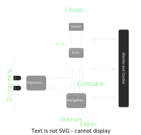

<h1 align="center">Autopilot Plus </h1>

<h3 align="center">
 System to perform fully autonomous flights, with the extra ability to intercept civilian aircrafts
</h3>

<!---->

<h4 align="center">
  <i>
    The software is being tested in X-Plane12, which is FAA-certified flight simulation software.
  </i>
</h4>

<h3 align="center">
    <a href="docs/README.md">Docs</a> - 
    <a href="docs/apidoc">API</a> - 
    <a href="docs/how-to-deploy">Deploy</a> -
    <a href="https://www.x-plane.com/pro/certified/">FAA X-Plane</a> 
 
</h3>

## Software Design
<h3>Avionic Control System</h3>  

 

<h3>Constructor components overview</h3>  

<h3>Avionic Control System Detail</h3>  

