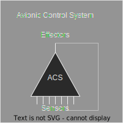
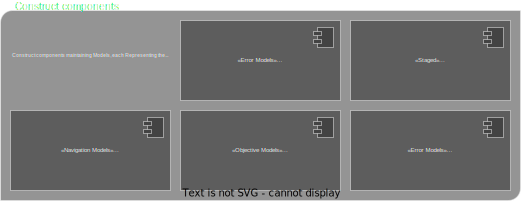

<h1 align="center">Autopilot Plus </h1>

<h3 align="center">
 System to perform fully autonomous flights, with the ability to intercept civilian aircraft
</h3>

<!---->

<h4 align="center">
  <i>
     We are not affiliated, associated, authorized, endorsed by, or in any way officially connected with Space Exploration Technologies Corp (SpaceX), or any of its subsidiaries or its affiliates. The names SpaceX as well as related names, marks, emblems and images are registered trademarks of their respective owners.
  </i>
</h4>

<h3 align="center">
    <a href="docs/README.md">Docs</a> - 
    <a href="docs/why-xplane">X-Plane12</a> - 
    <a href="docs/apidoc">API</a> - 
    <a href="docs/how-to-deploy">Deploy</a>
 
</h3>

## Design Pattern
<h3>Avionic Control System</h3>  

 

<h3>Constructor components overview</h3>  

